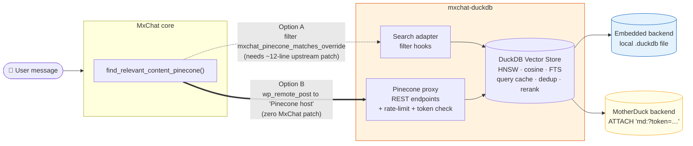
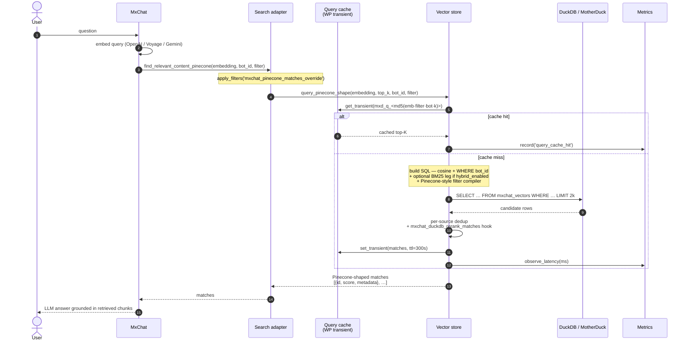

# Architecture

How **mxchat-duckdb** plugs into MxChat, how a query flows through the system, and where each class lives.

---

## How it plugs into MxChat

The plugin offers **two parallel integration paths** with MxChat's vector-search dispatch. Both are registered unconditionally; at runtime the faster one wins when its prerequisite is present.



### Option A — filter override (preferred)

When `mxchat-basic` is patched with the ~12-line snippet in [`patches/README.md`](patches/README.md), the plugin hooks the `mxchat_pinecone_matches_override` filter and returns matches from DuckDB *before* MxChat would have made the Pinecone HTTP call. **Zero round-trip overhead.**

### Option B — Pinecone wire-protocol proxy (zero patch)

Without the patch, the plugin uses the existing `mxchat_get_bot_pinecone_config` filter to register itself as the Pinecone backend, and serves a REST namespace at `/wp-json/mxchat-duckdb/v1/pinecone-proxy/` that emulates the Pinecone wire protocol (`/query`, `/vectors/fetch`, `/vectors/upsert`, `/vectors/delete`, `/vectors/list`). MxChat thinks it's talking to Pinecone; the proxy translates each call to DuckDB SQL.

Both paths return identical results.

---

## Query lifecycle

What actually happens when the chatbot answers a question. Numbered arrows show the order; dashed boxes are conditional steps.



**Cache invalidation**: any `upsert()` or `delete_*()` call on the vector store nukes the query-cache transients via `MxChat_DuckDB_Plugin::flush_query_cache()`. So stale top-Ks can survive at most `query_cache_ttl` seconds, or until the next write, whichever comes first.

**Hybrid retrieval**: when `hybrid_enabled = true` *and* the `mxchat_duckdb_query_text` filter returns a non-empty string, the store runs two over-fetched queries (vector + BM25), min-max-normalises both score lists, blends them with `hybrid_alpha`, and reranks. Falls back to pure vector when DuckDB FTS isn't available.

**Slow-query log**: every `observe_latency()` checks the result against `slow_query_ms` and writes a one-liner to PHP's error log on breach, with bot id and feature flags inlined.

---

## File layout

```
mxchat-duckdb/
├── mxchat-duckdb.php                              Plugin bootstrap
├── uninstall.php                                  Full cleanup on plugin delete
├── readme.txt                                     WordPress.org plugin-directory readme
├── composer.json                                  Classmap autoload + dev-deps
├── phpstan.neon.dist                              PHPStan config (level 6)
├── phpunit.xml.dist                               PHPUnit config
├── LICENSE                                        GPL v2
├── .github/workflows/
│   ├── ci.yml                                     php -l matrix + msgfmt + PHPStan + PHPUnit
│   └── release.yml                                Build & attach release zip on v* tags
├── includes/
│   ├── class-duckdb-options.php                   Settings + defaults + directory blockers
│   ├── class-duckdb-metrics.php                   Rolling latency window + counters
│   ├── class-duckdb-quantization.php              INT8 round-trip helpers
│   ├── class-duckdb-connection.php                Interface + cached factory
│   ├── class-duckdb-motherduck-connection.php     ATTACH wrapper over the embedded backend
│   ├── class-duckdb-embedded-connection.php       PECL + CLI backend with init-SQL + retry
│   ├── class-duckdb-vector-store.php              Versioned schema, hybrid query, Parquet I/O
│   ├── class-duckdb-sync.php                      Bulk sync + reprocess + WP-cron + bot_id detection
│   ├── class-duckdb-async-reprocess.php           Action Scheduler driver
│   ├── class-duckdb-pinecone-migrator.php         Resumable Pinecone → DuckDB copier
│   ├── class-duckdb-compactor.php                 Daily orphan-vector pruning cron
│   ├── class-duckdb-pinecone-proxy.php            REST endpoints (rate-limited, per-namespace tokens)
│   ├── class-duckdb-search-adapter.php            Filter hooks (Option A + Option B) + error notices
│   ├── class-duckdb-health.php                    /wp-json/mxchat-duckdb/v1/health
│   ├── class-duckdb-cli.php                       WP-CLI commands (only loaded under WP_CLI)
│   └── class-duckdb-admin.php                     Settings page + AJAX
├── admin/views/
│   └── settings.php                               Settings UI template
├── assets/
│   └── admin.js                                   AJAX handlers (test, sync, reprocess)
├── languages/
│   ├── mxchat-duckdb.pot                          Translation template
│   ├── mxchat-duckdb-fr_FR.po                     French translation source
│   └── mxchat-duckdb-fr_FR.mo                     French compiled catalog
├── tests/
│   ├── bootstrap.php                              PHPUnit bootstrap (WP function shims)
│   ├── phpstan-bootstrap.php                      PHPStan WP stubs
│   └── unit/                                      Smoke tests on pure-PHP utilities
├── patches/
│   └── README.md                                  Optional upstream patch (Option A)
├── ARCHITECTURE.md                                (this file)
├── CHANGELOG.md
├── CONTRIBUTING.md
└── README.md
```

## Design conventions

- **Single connection per request.** `MxChat_DuckDB_Connection_Factory::current()` is the only sanctioned way to obtain a backend handle; it caches one instance per request, keyed by mode + token fingerprint. Construct one by hand and you silently bypass the cache.
- **Schema changes are migrations.** Bump `MxChat_DuckDB_Vector_Store::TARGET_SCHEMA_VERSION` and add an `apply_migration()` branch. Migrations must be idempotent — they may run against an install that already has part of the target state.
- **Writes invalidate the cache.** `upsert()` and `delete_*()` flush the query cache themselves via `MxChat_DuckDB_Plugin::flush_query_cache()`. Any new write path must do the same.
- **No HTTP for MotherDuck.** MotherDuck has no public SQL-execution REST API; all traffic goes through DuckDB's native protocol via `ATTACH 'md:…'`.
- **Errors are surfaced, not swallowed.** Use `error_log()` + the `last_error` option + the admin-notice transient instead of returning empty matches silently — except where graceful degradation is explicitly documented (FTS missing, HNSW unavailable).
